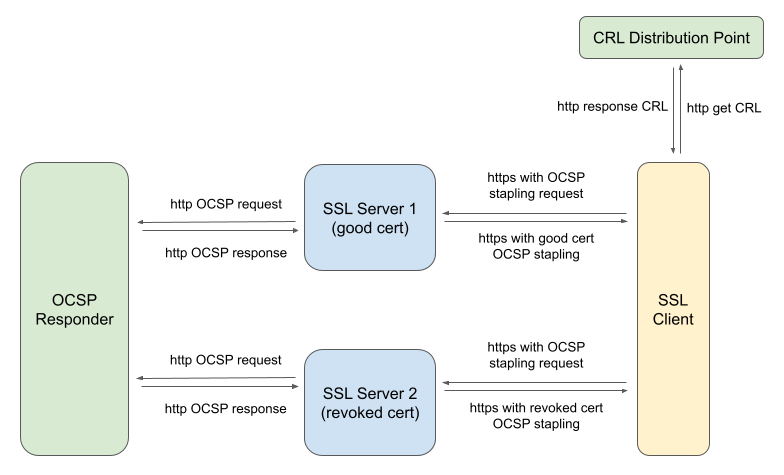
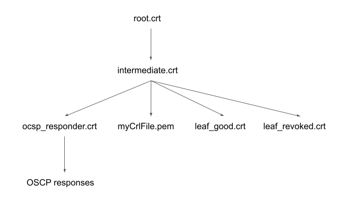

# Containers Deployment
The setup involves 5 containers. They are 
- an OCSP responder
- a CRL distribution point
- a SSL client
- 2 SSL servers using good and revoked cert respectively.


# Signing Relation



# Usage
## Clone the repository
```
git clone https://github.com/eggburg/PKI-Docker-TestBed.git
cd PKI-Docker-TestBed/
```

## (Optional) Regenerate the certs and CRL file

```
./regen_certs.sh
```

## Bring up the testbed environment

```
docker-compose up
```
Remark: if you want to run it in the background without printing logs, run "docker-compose up -d" instead


## Test from the SSL client container

Access the SSL client container.
```
$ docker exec -it tls_client_container bash
```

### Send SSL connection to SSL server with OCSP stapling request
Send SSL connection to the SSL server 1, the one that is using the good cert
```
bash-5.1# openssl s_client -connect tls.server.good:12345 -CAfile certs/root_intermediate.crt -status
```
You should be able to see the OCSP stapling request from the SSL client, and "Cert Status: good" in the OCSP response data sent from the SSL server.

Send SSL connection to the SSL server 2, the one that is using the revoked cert
```
bash-5.1# openssl s_client -connect tls.server.revoked:54321 -CAfile certs/root_intermediate.crt -status
```
You should be able to see the OCSP stapling request from the SSL client, and "Cert Status: revoked" in the OCSP response data sent from the SSL server.

### Test CRL
Fetch CRL from the CRL distribution point, and use it to generate the crl chain file.
```
bash-5.1# curl -s http://crl.pki.eggburger/myCrlFile.pem > crl.pem
bash-5.1# cat certs/root_intermediate.crt crl.pem > crl_chain.pem
```

Fetch the good server's cert and verify it against the CRL
```
bash-5.1# openssl s_client -showcerts -connect tls.server.good:12345 2>/dev/null </dev/null | sed -ne '/-BEGIN CERTIFICATE-/,/-END CERTIFICATE-/p' > good_server_certs
bash-5.1# openssl verify -crl_check -CAfile crl_chain.pem good_server_certs
good_server_certs: OK   <===== good status based on the CRL
```

Fetch the revoked server cert and verify it against the CRL
```
bash-5.1# openssl s_client -showcerts -connect tls.server.revoked:54321 2>/dev/null </dev/null | sed -ne '/-BEGIN CERTIFICATE-/,/-END CERTIFICATE-/p' > revoked_server_certs
bash-5.1# openssl verify -crl_check -CAfile crl_chain.pem revoked_server_certs 
C = US, L = San Jose, CN = leaf_revoked_cn
error 23 at 0 depth lookup: certificate revoked  <===== revoked status based on the CRL
error server_cert: verification failed
```


# Enhancement Ideas
- Add DNS server container to the testbed

  For now we are resolving domain names by specifying "extra_hosts" in the docker-compose.yml file
- Add differnet types of SSL server like apache or NGINX

  For now the SSL server is run by openssl command

- Add scripts to capture the packets while running the tests

